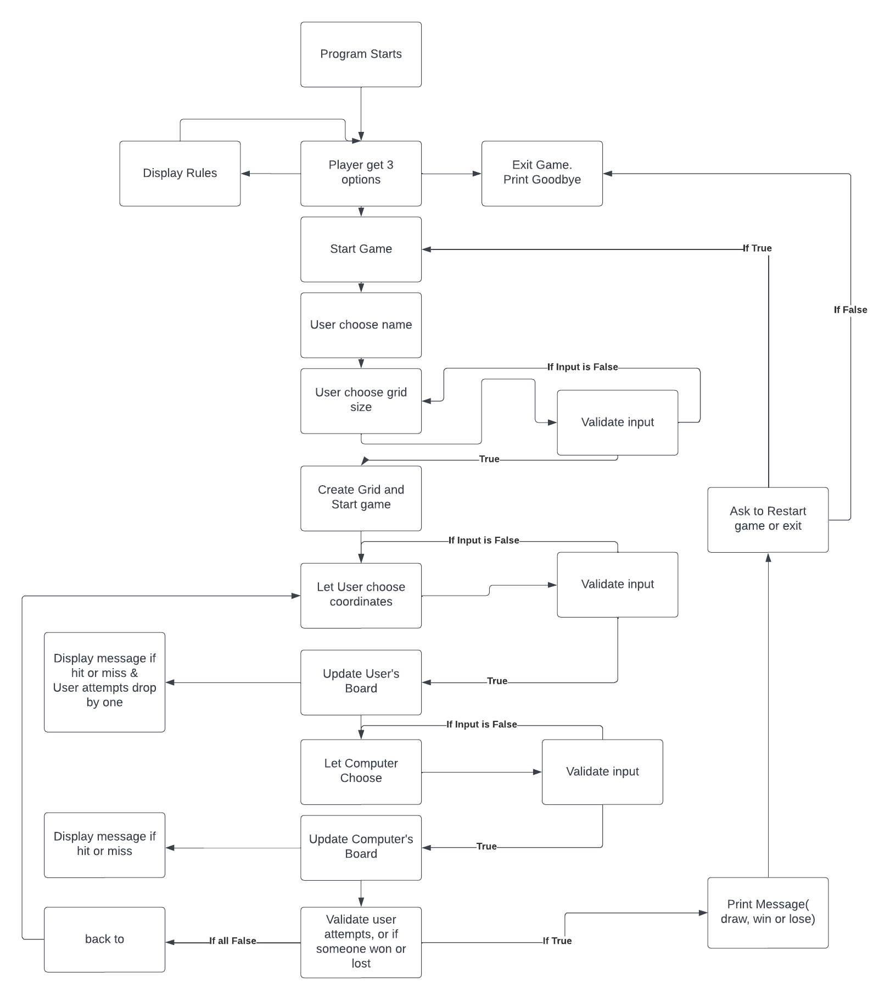
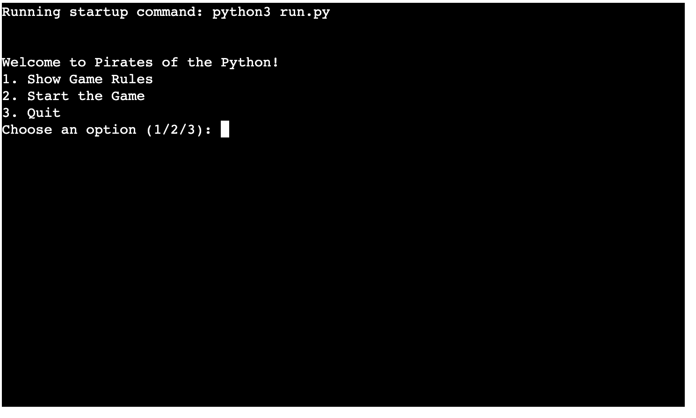
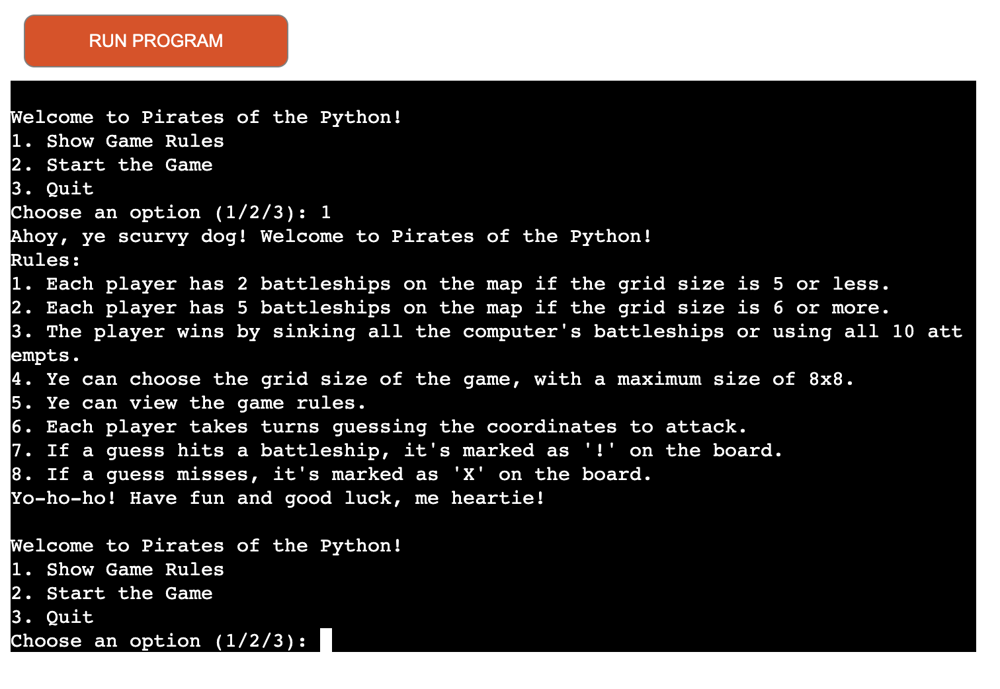
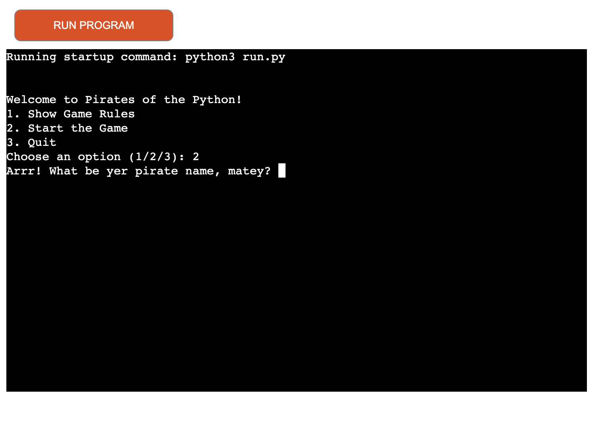
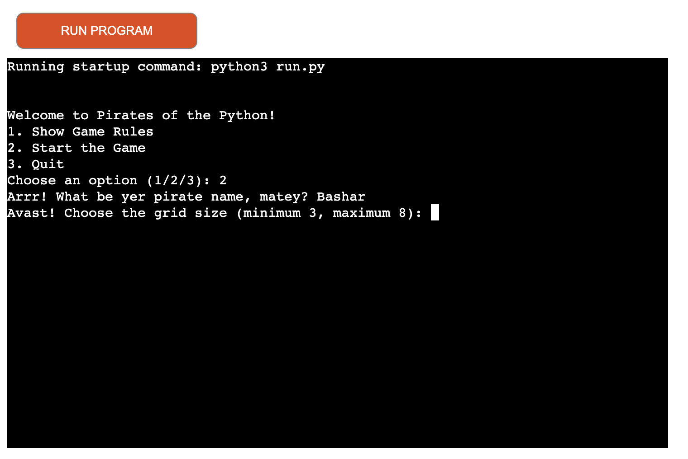
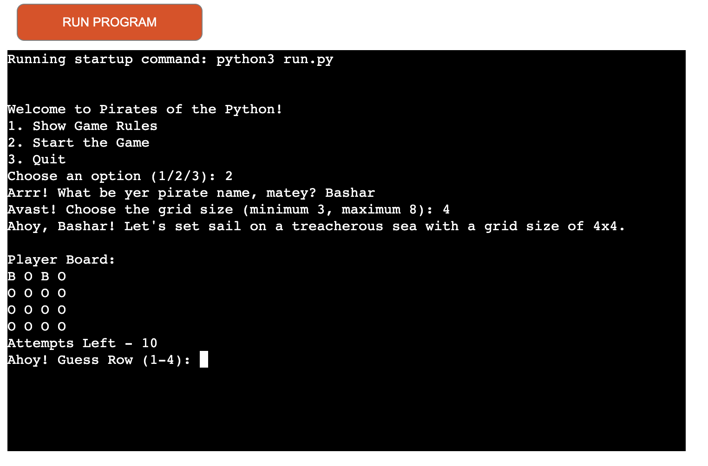
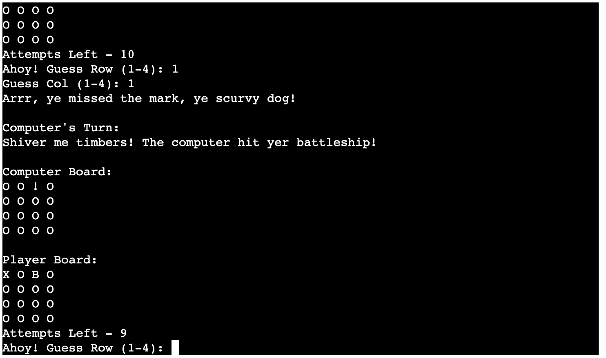
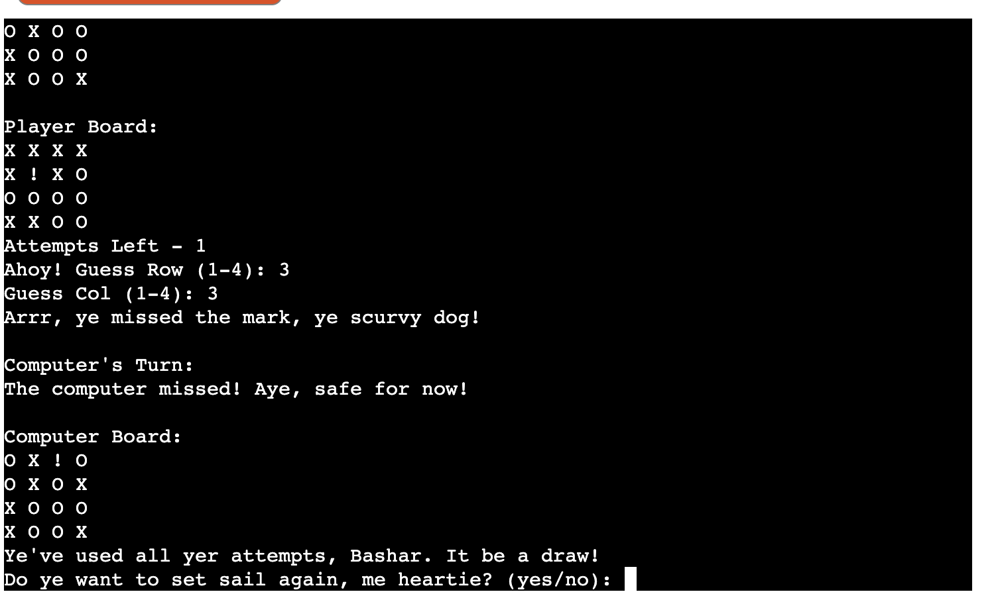
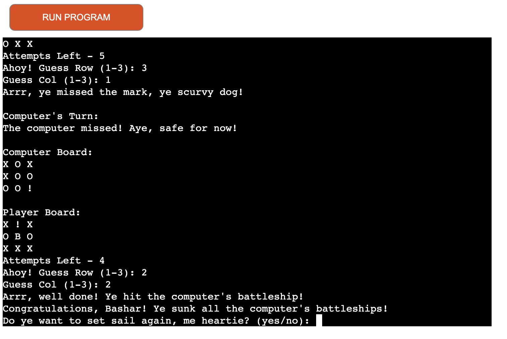
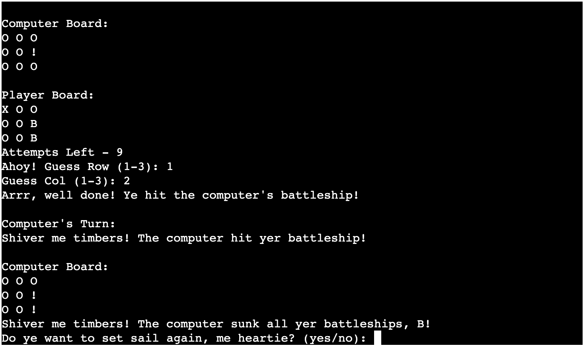

# Pirates of the Python

## Contents

* [User Experience (UX)](#user-experience-ux)
  * [User Goals](#user-goals)

* [Design](#design)
  * [Flowchart](#flowchart)

* [How to Play](#how-to-play)

* [Features](#features)
  * [Future Implementations](#future-implementations)

* [Technologies Used](#technologies-used)

* [Deployment & Local Deployment](#deployment--local-development)

* [Testing](#testing)

* [Credits](#credits)

## User Experience (UX)

### Initial Discussion

- This program is a pirate-themed version of the classic Battleship game called "Pirates of the Python.".

#### User Goals

-  In this game, the user's goal is to strategically choose coordinates and sink the computer's battleships before the computer sinks user's ships. It's a playful twist on the classic Battleship game.

## Design

#### Flowchart

## How to Play

"Pirates of the Python" follows the classic gameplay of the game "Battleship." At the main menu, the user can choose to start the game, display rules, or exit the game. Once the game begins, a set of randomly generated ships will be displayed for the user and the computer. The user will also see a blank board for reference.

During the user's turn, they will choose a row and a column. The grid will be updated to reflect hits ('!') or misses ('X'). The first to sink all the opponent's battleships wins the game. After the game, the user has the option to play again.

Live version of the game can be found here: [Pirates of the Python](https://pirates-of-the-python-908715cee4da.herokuapp.com/)

## Features

Additionally, players can personalize their experience by choosing a pirate name. They also have the flexibility to set the grid size between 3 and 8 for added customization.

### Start Screen

At the start of the game, players are greeted with the "Pirates of the Python" logo set against a pirate-themed background. Below the logo, a menu offers the following options:

1. Display Rules
2. Start Game
3. Exit Game

 

### Display Rules

Display Rules when user choose 1.

### Start Game

Start Game when user choose 2

### Choosing Grid Size

Let user choose Grid size for the game, and show the board.

### Choosing Row & Column

Let user choose column & row and show results on board.

### Draw - Attempts used

Result a draw, if user uses all attempts.

### User Wins

Result a win, if user hit all computer battleships.

### Computer Wins

Result a lose, if computer wins.

#### Future Implementations

I might incorporate a scoring system for the player and potentially allow them to manually choose the positions of their battleships.

## Technologies Used

### Languages and Python Packages/Libraries Used

- [Python](https://www.python.org/) 

- [Random](https://www.w3schools.com/python/module_random.asp)
    - Random was used to generate the user's ships and computer ships at the beginning of the game.

### Frameworks and Programs Used

- #### [GitPod](https://gitpod.io/)
The entire project was coded using Visual Studio Code.

- #### [GitHub](https://github.com/)
    - GitHub was used to store the code online and serves as a source for Heroku.

- #### [Heroku](https://dashboard.heroku.com/login)
    - Heroku was used to deploy the Python Terminal online once it was linked to the Repo.

- #### [Lucidchart](https://www.lucidchart.com/pages/)
    - Draw.io was used to create the flowchart for "Pirates of the Python."

## Deployment

To deploy the final build of the project online, Heroku was used. The deployment process involved the following steps:

1. Push the latest code to GitHub.
2. Go to Heroku.
3. Create a new app.
4. Enter the application name and choose Europe for the region.
5. Search for the Repo.
6. Connect to the relevant repo you want to deploy.
7. Go to the settings tab.
8. Add buildpacks.
9. Select Python and save changes.
10. Select Nodejs and save changes.
11. Ensure that Heroku/Python is at the top of the list, followed by Heroku/Nodejs.
12. Go to the deploy tab.
13. Scroll down to Manual Deploy and select deploy branch.

## Testing

### Validation Checks

## Bugs

### Resolved Bugs

### Unresolved Bugs

## Credits

## Acknowledgements